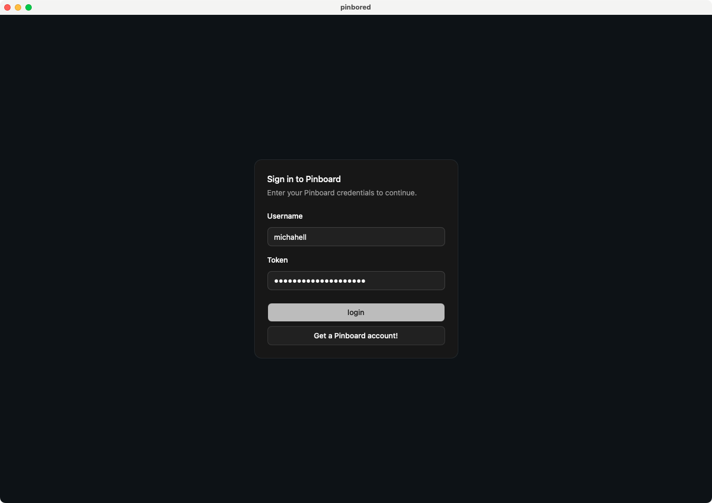
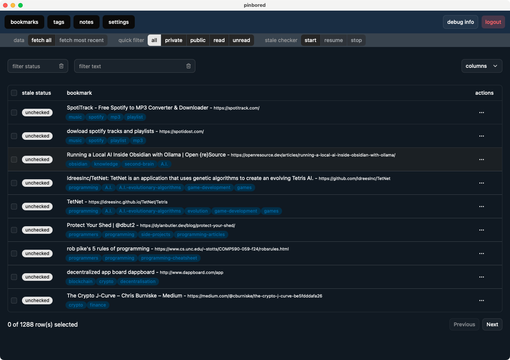
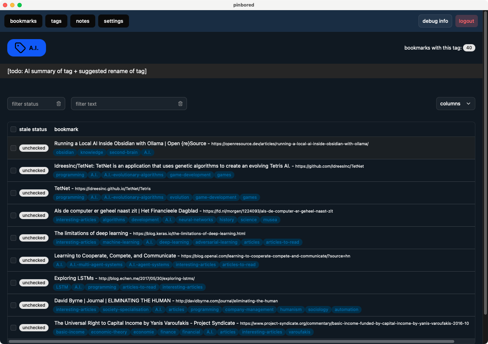

# Pinbored

Pinbored is a _desktop_ tool being built to administer pinboard.in _bookmarks_, _tags_ and _note_ collections.
See below [screenshots](#screenshots) for an impression.
There is no 1.0 release yet - everything is still very much in flux.

Future plans include ways to administer locally by moving collections into a single-file SQLite DB that is easily shared using local file-system or cloud-storage.

Built with Tauri, Angular, Spartan-NG, Signality and Signalstory.

 

## Project history

Please be seated for the fourth iteration of Pinbored:

* [iteration one](https://github.com/michahell/pinbored-AS3) ([Adobe Air](https://airsdk.harman.com/) / [AS3](https://airsdk.dev/reference/actionscript/3.0/) / [Starling](https://gamua.com/starling/) / self-built UI)
* [iteration two](https://github.com/michahell/pinbored-nwjs) ([nwjs](https://nwjs.io/) / [angular.js](https://angularjs.org/) / self-built UI)
* [iteration three](https://github.com/michahell/pinbored-tauri-svelte) ([Tauri v1](https://v1.tauri.app/) / [Svelte](https://svelte.dev/) / [carbon-design-system](https://carbondesignsystem.com/))
* [this iteration four](https://github.com/michahell/pinbored-tauri) ([Tauri v2](https://tauri.app/) / [Angular 21](https://angular.dev/) / [spartan-ng](https://spartan.ng/))

## Recommended IDE Setup

By Tauri:

[VS Code](https://code.visualstudio.com/) + [Tauri](https://marketplace.visualstudio.com/items?itemName=tauri-apps.tauri-vscode) + [rust-analyzer](https://marketplace.visualstudio.com/items?itemName=rust-lang.rust-analyzer) + [Angular Language Service](https://marketplace.visualstudio.com/items?itemName=Angular.ng-template).

By me:

[IntelliJ](https://www.jetbrains.com/idea/) + [Rust plugin](https://plugins.jetbrains.com/plugin/22407-rust)

## [Screenshots](#screenshots)

last update: 26-05-2026

#### login

#### bookmarks

#### tags

